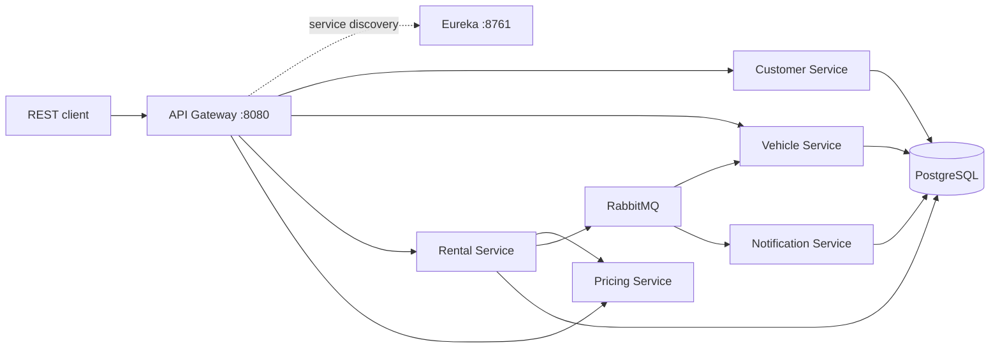

# vehicle-rental-system - Distributed Vehicle Rental Platform


A compact microservices platform for browsing vehicles, creating rentals, calculating prices, and processing
notifications asynchronously. The project intentionally focuses on a coherent architecture instead of adding
infrastructure for its own sake.

## Architecture



REST is used for request/response operations and pricing. Eureka provides discovery, the Gateway is the public entry
point, and RabbitMQ carries `RentalCreated`-style events to independent consumers. Each data-owning service owns its
persistence model; no service queries another service's tables.

## Services

| Service                | Responsibility                           | Main dependencies                |
|------------------------|------------------------------------------|----------------------------------|
| `api-gateway`          | Public routing through discovery         | Spring Cloud Gateway, Eureka     |
| `discovery-server`     | Service registry                         | Eureka Server                    |
| `customer-service`     | Customer CRUD                            | Web, JPA, PostgreSQL, Validation |
| `vehicle-service`      | Vehicles and availability                | Web, JPA, PostgreSQL, AMQP       |
| `rental-service`       | Rental lifecycle and event publishing    | Web, JPA, PostgreSQL, AMQP       |
| `pricing-service`      | Category rates and duration discounts    | Web, Eureka                      |
| `notification-service` | Asynchronous notification log/simulation | Web, AMQP                        |

## Features

- Customer and vehicle management APIs
- Vehicle filtering by category and availability status
- Rental creation with `PENDING` lifecycle state
- Pricing by vehicle category with weekly and monthly discounts
- RabbitMQ events consumed by Vehicle and Notification services
- Eureka service discovery and Gateway entry point
- Docker Compose environment with PostgreSQL and RabbitMQ Management UI
- Independent Gradle build for every deployable service
- Testcontainers integration tests for every microservice

## Prerequisites

- JDK 21
- Docker Engine with Docker Compose
- Gradle 8.14+ (or the included root wrapper)

## Quick start

Start the complete environment:

```bash
docker compose up --build
```

The Gateway is available at `http://localhost:8080`, Eureka at `http://localhost:8761`, and RabbitMQ Management at
`http://localhost:15672` (`guest` / `guest`).

On Windows PowerShell, build an individual service with the shared wrapper:

```powershell
.\gradlew.bat -p rental-service build
```

Each directory has its own `settings.gradle.kts` and `build.gradle.kts`, so a locally installed Gradle can also build it
directly:

```bash
cd rental-service
gradle build
```

## API examples

Requests may be sent directly to a service during development or routed through the Gateway using the discovered service
id.

Create a customer:

```http
POST /customers
Content-Type: application/json
```

```json
{
  "firstName": "Ada",
  "lastName": "Lovelace",
  "email": "ada@example.com",
  "phone": "+48 555 010 010"
}
```

Create a vehicle:

```http
POST /vehicles
Content-Type: application/json
```

```json
{
  "registrationNumber": "W0 FF001",
  "make": "Toyota",
  "model": "RAV4",
  "category": "SUV",
  "dailyRate": 70
}
```

Filter available vehicles with `GET /vehicles?category=SUV&status=AVAILABLE`.

Calculate a rental price:

```bash
curl "http://localhost:8080/pricing-service/pricing/calculate?vehicleCategory=SUV&startDate=2026-08-20&endDate=2026-08-25"
```

Create a rental with `POST /rentals` using `customerId`, `vehicleId`, `startDate`, and `endDate` UUID/date fields. The
service persists the rental and publishes its event to RabbitMQ.

## Configuration

| Variable        | Default                                                  | Description         |
|-----------------|----------------------------------------------------------|---------------------|
| `DB_URL`        | `jdbc:postgresql://localhost:5432/vehicle_rental_system` | PostgreSQL JDBC URL |
| `DB_USERNAME`   | `vehicle_rental_system`                                  | PostgreSQL username |
| `DB_PASSWORD`   | `vehicle_rental_system`                                  | PostgreSQL password |
| `RABBITMQ_HOST` | `localhost`                                              | RabbitMQ hostname   |
| `EUREKA_URL`    | `http://localhost:8761/eureka`                           | Eureka registry URL |

## Testing

Run a service's complete test suite:

```powershell
.\gradlew.bat -p customer-service test
.\gradlew.bat -p vehicle-service test
.\gradlew.bat -p rental-service test
.\gradlew.bat -p notification-service test
.\gradlew.bat -p pricing-service test
```

The database and messaging tests start disposable PostgreSQL and/or RabbitMQ containers automatically. Docker must be
running. Gateway and Discovery also have independent Spring Boot test dependencies and can be built without the
infrastructure.

## Project structure

```text
vehicle-rental-system/
|-- api-gateway/
|   |-- src/main/java/dev/asyncluna/rental/gateway/       # API Gateway
|   `-- src/main/resources/                              # application.yml
|-- discovery-server/
|   |-- src/main/java/dev/asyncluna/rental/discovery/    # Eureka registry
|   `-- src/main/resources/                              # application.yml
|-- customer-service/
|   |-- src/main/java/dev/asyncluna/rental/customer/     # Customer API and persistence
|   |-- src/main/resources/                              # application.yml
|   `-- src/test/java/dev/asyncluna/rental/customer/     # Testcontainers tests
|-- vehicle-service/
|   |-- src/main/java/dev/asyncluna/rental/vehicle/      # Vehicle API and persistence
|   |-- src/main/resources/                              # application.yml
|   `-- src/test/java/dev/asyncluna/rental/vehicle/      # Testcontainers tests
|-- rental-service/
|   |-- src/main/java/dev/asyncluna/rental/rental/       # Rental API, persistence, events
|   |-- src/main/resources/                              # application.yml
|   `-- src/test/java/dev/asyncluna/rental/rental/       # Testcontainers tests
|-- pricing-service/
|   |-- src/main/java/dev/asyncluna/rental/pricing/      # Pricing API and rules
|   |-- src/main/resources/                              # application.yml
|   `-- src/test/java/dev/asyncluna/rental/pricing/      # Service tests
|-- notification-service/
|   |-- src/main/java/dev/asyncluna/rental/notification/ # RabbitMQ consumer
|   |-- src/main/resources/                              # application.yml
|   `-- src/test/java/dev/asyncluna/rental/notification/ # Testcontainers tests
|-- docker-compose.yml                                   # PostgreSQL and RabbitMQ
|-- gradlew / gradlew.bat
|-- README.md
`-- LICENSE
```

## License

This project is licensed under the [MIT License](LICENSE).
